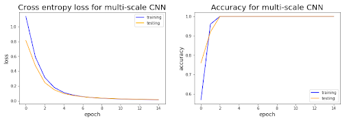
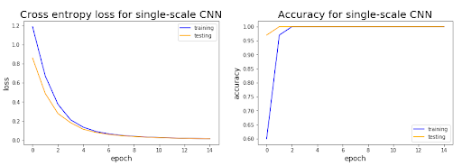
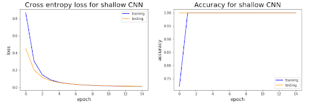

# EEG for BCI

This project is done as a part of course Neural Networks & Fuzzy Logic(BITS F312) at Birla Institute of Technology & Science Pilani. 

The project presentation can be found [here](https://docs.google.com/presentation/d/1pM84G8_HE_Jl1Dl6kfvyh_vt-G4tE3b4jn-5WQHSBps/edit?usp=sharing).

#### Team:

- Venkata Sai Kiran Piratla
- Kalimi Venkata Yashwanth Kumar Reddy
- Yaswanth Kumar Rayapati

---

This repository contains code to run experiments which closely simulate those run by Liu Jingwei et al. in the paper [Deep learning EEG response representation for brain computer interface](https://ieeexplore.ieee.org/document/7260182).

The EEG data used in these series of experiments is from [Project BCI - EEG motor activity data set](https://sites.google.com/site/projectbci/), Brain Computer Interface research at NUST Pakistan.

---

## Approach:
 
Use deep learning algorithm to learn a set of high-level feature representations, referred to as Deep Motor Features (DeepMF), for brain computer interface(BCI) with imagined motor tasks. As the extracted DeepMF are dissimilar for different tasks and alike for the same tasks, it is convenient to separate the diverse EEG signals for imagined motor tasks apart. Our aim is to achieve maximum accuracy within as less amount of time as possible.

---

## Observations:

---
## Tabulated Results:

|       | Multi Scale CNN | Single Scale CNN | Shallow CNN |
| --- | --- | --- | --- |
| Epochs to reach maximum accuracy | 3 | 3 | 2 |
| Time taken to reach maximum accuray | 5 ms/step | 3.923 ms/step | 2.817 ms/step |
| Trainable parameters | 51,844 | 29,364 | 48,104 |

We achieved the maximum accuracy in significantly lesser time, compared with the conventional BLDA algorithm which needs atleast 8.75 seconds trials to achieve the same accuracy. Accordingly the BCI response time and the required trials for training are almost declined by half.

## Instructions to run:
Conda installation is a prerequisite.

Open up the terminal and type:

    
    git clone https://github.com/piratlasaikiran/EEG_for_BCI
    cd EEG_for_BCI
    conda env create -f environment.yml
    conda activate nnfl
    cd CNN models
    jupyter notebook
    
    
    
Open up `multi-scale CNN.ipynb`, `shallow CNN.ipynb` and `single-scale CNN.ipynb` to run the respective  CNN architectures or you can directly use the trained models by following below instructions

1. load desired trained model from `trained CNN model` directory in a jupyter notebook
2. load data from `datasets` directory as .csv file
3. perform data pre-processing as mentioned in paper (You can refer any notebook in `CNN models` directory for the same)
4. evaluate on loaded model using pre-processed data

   

